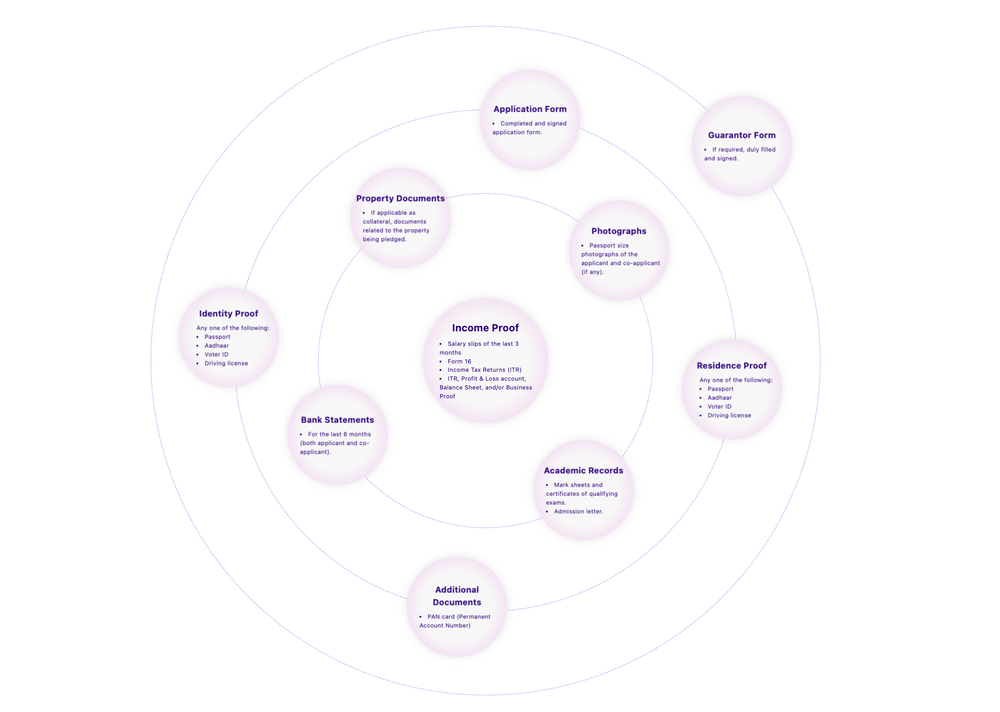

# EpiScholar SDE Project

## Description

This project is a "Featured Component" that displays row data extracted from an Excel file. The project involves both backend and frontend tasks, including data extraction, API creation, and frontend implementation. The project is deployed on Vercel and can be reviewed through the provided deployment and GitHub links.

## Table of Contents

- [Description](#description)
- [Installation](#installation)
- [Usage](#usage)
- [Hosting](#hosting)
- [Screenshots](#screenshots)
- [Technologies Used](#technologies-used)
- [Contributing](#contributing)
- [License](#license)

## Installation

### Backend

1. Clone the repository:
    ```sh
    git clone https://github.com/sumeetbidhan/epischolar_project

    cd epischolar-assignment/backend
    ```

2. Install dependencies:
    ```sh
    npm install
    ```

3. Start the server:
    ```sh
    npm start
    ```

### Frontend

1. Navigate to the frontend directory:
    ```sh
    cd ../frontend
    ```

2. Install dependencies:
    ```sh
    npm install
    ```

3. Start the development server:
    ```sh
    npm run dev
    ```

## Usage

1. Run the backend server to provide the API endpoint.
2. Run the frontend development server to view the application.
3. Navigate to `http://localhost:3000` in your browser to view the frontend component.

## Hosting

- Deployment Link: [https://epischolar-project.vercel.app/](#)
- GitHub Repository: [https://github.com/sumeetbidhan/epischolar_project](#)

## Screenshots



## Technologies Used

- **Backend:** Node.js, Express.js
- **Frontend:** Next.js, React, Tailwind CSS
- **Data Extraction:** Python, Pandas
- **Hosting:** Vercel

## Contributing

Contributions are welcome! Please fork this repository and submit a pull request for any enhancements or bug fixes.

## License

This project is licensed under the MIT License. See the [LICENSE](LICENSE) file for details.

---


